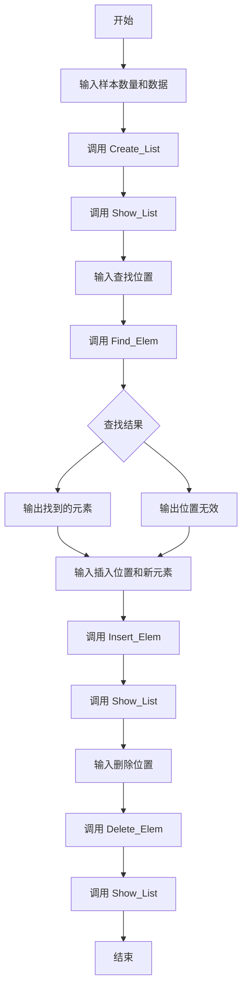

根据你提供的参考链接的标准，使用 Mermaid 来绘制每个函数的流程图。Mermaid 是一种常用的文本格式化流程图绘制工具，以下是整个代码的各个流程图以及子函数的流程图，包括主程序、链表创建、查找、插入、删除和显示的流程。

### 主程序流程图



### Create_List 函数流程图

```mermaid
graph TD
    A[开始] --> B{r 是否为空或 n <= 0}
    B --> C1[输出 "数据为空"] --> D1[返回 NULL]
    B --> C{创建头节点 head}
    C --> D{是否创建成功}
    D --> D1[返回 NULL]
    D --> E{i < n}
    E --> F[创建链表节点]
    F --> G{节点创建成功}
    G --> G1[输出 "内存分配失败"] --> H1[返回 NULL]
    G --> H[填充数据 r[i]]
    H --> E
    E --> I[尾节点指向 NULL]
    I --> J[返回 head->next]
```

### Find_Elem 函数流程图

```mermaid
graph TD
    A[开始] --> B{链表是否为空}
    B --> C[返回 NULL]
    B --> D{pos > 1}
    D --> E[p = p->next]
    E --> F{p 是否为空}
    F --> G[输出 "越界！"] --> H[返回 NULL]
    F --> D
    D --> I[返回 p]
```

### Insert_Elem 函数流程图

```mermaid
graph TD
    A[开始] --> B{pos <= 0}
    B --> C[输出 "越界"] --> D[返回 ERROR]
    B --> E[创建新节点 s]
    E --> F{创建成功？}
    F --> G[输出 "内存分配失败"] --> H[返回 ERROR]
    F --> I[填充新节点数据]
    I --> J{链表是否为空}
    J --> K[head = s]
    J --> L[调用 Find_Elem]
    L --> M[插入新节点到链表]
    M --> N[返回 CORRECT]
```

### Delete_Elem 函数流程图

```mermaid
graph TD
    A[开始] --> B{position <= 0}
    B --> C[输出 "越界"] --> D[返回 ERROR]
    B --> E{链表是否为空}
    E --> F[输出 "链表为空"] --> G[返回 ERROR]
    E --> H[调用 Find_Elem]
    H --> I{p->next 是否为空}
    I --> J[输出 "无元素可以删除"] --> K[返回 ERROR]
    I --> L[删除节点]
    L --> M[返回 CORRECT]
```

### Show_List 函数流程图

```mermaid
graph TD
    A[开始] --> B{链表是否为空}
    B --> C[输出 "链表为空"] --> D[返回 ERROR]
    B --> E{p->next != NULL}
    E --> F[输出 p->data]
    F --> G[p = p->next]
    G --> E
    E --> H[输出最后一个节点数据]
    H --> I[返回 CORRECT]
```

你可以将这些 Mermaid 代码复制到支持 Mermaid 的工具中（如 [Mermaid Live Editor](https://mermaid-js.github.io/mermaid-live-editor/) 或 VS Code 的 Mermaid 插件）来生成相应的流程图。

这些流程图涵盖了主程序的总体流程，以及各个子函数的详细逻辑，包括链表创建、查找、插入、删除和显示。